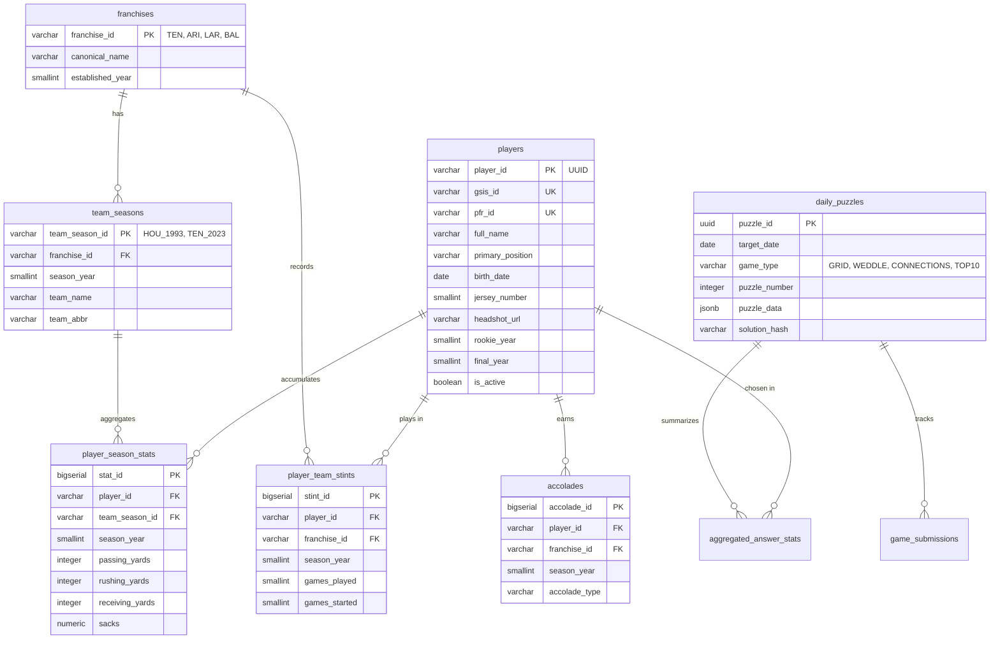

# NFL Daily Mini-Games Platform 🏈

[](https://fastapi.tiangolo.com/)
[](https://nextjs.org/)
[](https://www.postgresql.org/)
[](https://www.python.org/)
[](https://www.typescriptlang.org/)
[](file:///c:/Users/totof/Mis%20proyectos/nfl-games/SPECIFICATION.md)

A production-grade, spec-driven daily trivia and mini-game platform for the NFL. Built with **FastAPI**, **PostgreSQL 16+**, **Next.js 14+ (App Router)**, and powered by historical and active data extracted from `nflverse` / `nfl_data_py`.

> [!NOTE]
> This platform implements strict domain invariants around franchise lineage, game appearance eligibility, Bayesian rarity scoring, dynamic age calculations, and deterministic puzzle generation as outlined in [SPECIFICATION.md](file:///c:/Users/totof/Mis%20proyectos/nfl-games/SPECIFICATION.md).

---

## 📸 Overview & Mini-Game Modes

The platform hosts five distinct daily mini-game modes designed for NFL statistics, history, and trivia enthusiasts:

| Game Mode | Mechanics Summary | Budget / Constraints | Key Invariant / Features |
| :--- | :--- | :--- | :--- |
| **3x3 Grid** | Immaculate Grid style. Match 3 row criteria against 3 column criteria. | 9 guess budget | Player uniqueness invariant: Each player entity can only be used once per puzzle session. Bayesian rarity scoring. |
| **Guess the Player (Weddle)** | Deduce the mystery active NFL player using 8 comparative attribute clues. | 6 guess budget | Color-coded feedback (green exact, yellow partial/close match within $\pm 2$ units or positional group, gray incorrect) + higher/lower directional arrows (`↑`/`↓`). Anti-cheat mystery reveal on game-over. |
| **Connections 4x4** | 16 NFL entities partitioned into 4 difficulty-graded thematic groups of 4. | 4 strike budget | Unique exact partition verified via Knuth's Algorithm X. Advisory `is_one_away` signal on 3/4 matches with solution reveal on game-over. |
| **Top 10 Leaderboard** | Identify the top 10 historical leaders for iconic statistical/accolade prompts. | 3 incorrect strikes | Reveals rank, player name, and metric value upon correct guess. Repeat guesses do not consume strikes. |
| **Reverse Grid** *(Coming Soon)* | Pre-populated 9-player matrix; deduce the row/column criteria that satisfy all 9 cells. | 3 incorrect attempts | Criteria validation must satisfy all 9 static players simultaneously. |

---

## 🏛 Domain Invariants & Franchise Lineage

Handling 100+ years of NFL history and active player tracking requires strict domain invariants to eliminate ambiguities:

### 1. Franchise Continuum Rule
Puzzles querying franchise affiliation evaluate against the **Franchise Continuum ID**, not historic city names or transient acronyms.
* **Titans / Oilers:** Houston Oilers (1960–1996), Tennessee Oilers (1997–1998), and Tennessee Titans (1999–present) share `TEN`.
* **Rams Lineage:** Cleveland Rams (1937–1945), LA Rams (1946–1994, 2016–pres.), and St. Louis Rams (1995–2015) share `LAR`.
* **Commanders Lineage:** Boston Braves/Redskins (1932–1936), Washington Redskins (1937–2019), WFT (2020–2021), and Washington Commanders (2022–pres.) share `WAS`.

> [!IMPORTANT]
> **The Cleveland Browns / Baltimore Ravens Exception (1996 Legal Settlement):**  
> Per official NFL legal settlement, the Baltimore Ravens (`BAL`) are categorized as a 1996 expansion franchise. Pre-1996 Cleveland Browns history remains with `CLE` (suspended 1996–1998, reactivated 1999). A 1994 Browns player does **NOT** satisfy a "Played for Ravens" criterion.

### 2. Official Game Appearance Rule
A player is credited with playing for team $T$ in season $S$ if and only if:
$$\text{regular\_season\_games\_played}(P, T, S) \ge 1$$
* **Excluded:** Preseason-only roster spots, cut in training camp, Practice Squad, or Inactive Reserve (IR) without an active regular season game appearance.
* **Mid-Season Trades:** If a player appeared in $\ge 1$ regular season game for multiple teams in a single year, they satisfy the "Played for" criteria for both franchises.

### 3. Accolades & Statistical Criteria
* **Pro Bowl:** Official roster selection (original ballot or official accepted alternates).
* **All-Pro:** AP (Associated Press) First-Team All-Pro strictly.
* **Super Bowl Champion:** Must be on the official 53-man active roster or injured reserve of the winning team on the Super Bowl game date.
* **Career Sacks:** Official sacks recorded from 1982 onward.

### 4. Guess the Player (Weddle) Invariants & Attribute Rules
* **Active Pool Invariant:** Target selection is strictly bounded to active NFL players with verified metadata (team, position, birth date, height, jersey number).
* **Dynamic Real-Time Age Computation:** Ages are computed dynamically against the puzzle target calendar date from canonical `birth_date` to prevent leap-year and stale-year desyncs:
  $$\text{age}(P, D_{\text{ref}}) = \text{year}(D_{\text{ref}}) - \text{year}(P_{\text{dob}}) - \mathbb{I}[(\text{month}(D_{\text{ref}}), \text{day}(D_{\text{ref}})) < (\text{month}(P_{\text{dob}}), \text{day}(P_{\text{dob}}))]$$
* **Positional Sub-Groups for Yellow Partial Match:**
  * **Offensive Line (OL):** `OT`, `T`, `OG`, `G`, `C`, `OL`, `LT`, `RT`, `LG`, `RG`
  * **Defensive Back (DB):** `CB`, `S`, `FS`, `SS`, `DB`
  * **Defensive Line / Edge:** `DE`, `DT`, `NT`, `DL`, `EDGE`
  * **Linebackers:** `LB`, `ILB`, `OLB`, `MLB`
  * **Pass Catchers:** `WR`, `TE`
  * **Backfield:** `RB`, `FB`
* **Numeric Proximity & Directional Clues:**
  * Age, Height, and Jersey Number receive `yellow` if within $\pm 2$ units of the target.
  * Direction indicator displays `higher` (`↑`) if target is greater than guessed, or `lower` (`↓`) if target is smaller.
* **Anti-Tamper & Mystery Target Isolation:** Target player payload is strictly sanitized from API responses and only revealed upon game conclusion (solving or exhausting all 6 guesses).

---

## 📐 Math & Algorithmic Engine

### Bayesian Rarity Scoring (3x3 Grid)
To prevent cold-start anomalies early in the day, cell rarity uses a Bayesian smoothed rarity formula:

$$R^*(p, c) = \frac{n(p, c) + M \cdot \pi(p, c)}{N(c) + M} \times 100$$

Where:
* $M = 25$ (prior weight)
* $\pi(p, c) = \frac{1}{|S_c|}$ (uniform prior over historically valid answers)
* $n(p, c)$ is the count of user picks for player $p$ in cell $c$
* $N(c)$ is total picks for cell $c$

### $k$-Guaranteed Grid Solvability
Every generated cell $(r, c)$ in a 3x3 Grid must satisfy a minimum candidate intersection cardinality bound:
$$|S_{r, c}| = |\{P \mid \text{Satisfies}(P, R_r) \land \text{Satisfies}(P, C_c)\}| \ge k \quad (k = 3)$$

Puzzles with bottleneck cells ($|S_{r, c}| < 3$) or overall log-density $\sum \log_{10}(|S_{r, c}|) \notin [12.0, 22.0]$ are automatically rejected.

### Connections Uniqueness (Knuth's Algorithm X)
Connections 4x4 boards undergo Exact Cover validation via Algorithm X to ensure there is **strictly one unique 4-way disjoint partition** into valid quadruplets across the entire domain.

### Weddle Deterministic Target Selection Engine
Daily mystery target players are chosen deterministically using a seeded pseudo-random sequence:
$$\text{seed} = \text{int}(\text{target\_date.strftime}("\%Y\%m\%d")) + 5503$$

---

## 🗄 Relational Data Model



---

## 📂 Monorepo Architecture

```
nfl-games/
├── apps/
│   ├── api/                      # FastAPI (Python 3.11+) Backend Service
│   │   ├── app/
│   │   │   ├── api/v1/          # Versioned Endpoints (Grid, Weddle, Connections, Top10, Players)
│   │   │   │   └── endpoints/   # Endpoint routers (weddle.py, grid.py, connections.py, top10.py)
│   │   │   ├── core/            # Config, Redis client, DB session management
│   │   │   ├── db/              # SQLAlchemy 2.0 ORM Models & Session
│   │   │   ├── domain/          # Domain validators, generators, registries, Exact Cover Algorithm X
│   │   │   ├── schemas/         # Pydantic v2 schemas (Weddle, Grid, Connections, Top10)
│   │   │   └── services/        # Scoring, Solvability & Weddle Comparison Algorithms
│   │   └── tests/               # Pytest suite (API, validation, age calculation, data integrity)
│   └── web/                      # Next.js 14+ (App Router) Frontend Client
│       ├── app/                 # App Router pages (/grid, /weddle, /connections, /top10, /reverse-grid)
│       ├── components/          # UI components (Navbar, PlayerSearchModal, PlayerTile, StreakModal)
│       │   └── game-boards/     # Game boards (WeddleBoard, GridBoard, ConnectionsBoard, Top10Board)
│       ├── hooks/               # Custom state hooks (useWeddleGameState, useTop10GameState)
│       ├── lib/                 # API client, storage/state synchronization, HMAC security
│       └── public/              # Team logos, static assets & gzipped search catalog
├── packages/
│   ├── contracts/                # Shared TypeScript types auto-generated from OpenAPI / backend schemas
│   └── etl/                      # Data pipeline, backfills, sync scripts & puzzle generators
│       ├── generator/           # Seeded deterministic puzzle generation engines
│       ├── pipeline/            # Raw data extraction, transform, enrichment & loading
│       └── sql/                 # Verification & diagnostic SQL scripts
├── scripts/                      # Operational diagnostic & data repair utilities
├── docs/                         # Additional documentation
├── README.md                     # Project Overview
└── SPECIFICATION.md              # Technical Specification Document (SDD-001)
```

---

## ⚡ Performance Budgets & SLA Requirements

| Metric | Target / Ceiling | Implementation Strategy |
| :--- | :--- | :--- |
| **Client Search Autocomplete P95** | $\le 50\text{ ms}$ | In-memory Trie / Fuse search index running client-side with headshots & logos |
| **API Guess Validation P95** | $\le 150\text{ ms}$ | FastAPI async pipeline + PostgreSQL indexed queries + Redis cache |
| **Search Bundle Payload Size** | $\le 400\text{ KB}$ | Gzipped array-of-arrays wire format (`Cache-Control: immutable`) |
| **Search Bundle Heap Footprint** | $\le 4.5\text{ MB}$ | Parsed browser heap footprint |
| **Daily Puzzle Generation SLA** | $\le 120\text{ sec}$ | Batch compute executed at 00:00:00 UTC for Day $D+7$ |
| **API Availability SLA** | $99.9\%$ | Redundant serverless/container deployment |

---

## 🔌 API Endpoints & Error Protocols

All error responses strictly adhere to **RFC 7807 (Problem Details for HTTP APIs)**:

```json
{
  "type": "https://api.nflminigames.com/v1/errors/INVALID_SUBMISSION",
  "title": "Invalid Guess Submission",
  "status": 422,
  "detail": "Player '00-0033873' has already been used in cell (0, 1) for this puzzle session.",
  "instance": "/api/v1/grid/validate",
  "error_code": "PLAYER_ALREADY_USED",
  "timestamp": "2026-09-04T20:00:45Z"
}
```

### Core API Endpoints Reference

* `GET /api/v1/puzzles/{game_type}/daily` — Fetch daily puzzle (sanitized, answers excluded).
* `POST /api/v1/grid/validate` — Validate a 3x3 grid guess submission & compute Bayesian rarity.
* `POST /api/v1/weddle/guess` — Submit a player guess against the daily mystery target across 8 attributes.
* `GET /api/v1/weddle/target/{puzzle_id}` — Reveal mystery player target upon game over or surrender.
* `POST /api/v1/connections/validate-group` — Validate 4-element group & return `is_one_away` status.
* `POST /api/v1/top10/guess` — Evaluate player guess against Top 10 leaderboard ranks.
* `GET /api/v1/players/search-index` — Fetch compact compressed search index.

#### Weddle Guess Response Example
```json
{
  "is_correct": false,
  "guesses_remaining": 5,
  "is_game_over": false,
  "comparison": {
    "player": {
      "player_id": "00-0033873",
      "full_name": "Patrick Mahomes",
      "headshot_url": "https://a.espncdn.com/combiner/i?img=/i/headshots/nfl/players/full/3139477.png&w=350&h=254",
      "team": "KC",
      "position": "QB",
      "side_of_ball": "Offense",
      "conference": "AFC",
      "division": "West",
      "age": 28,
      "height_inches": 74,
      "height_formatted": "6'2\"",
      "jersey_number": 15
    },
    "attributes": {
      "team": { "status": "gray", "direction": null },
      "side_of_ball": { "status": "green", "direction": null },
      "position": { "status": "green", "direction": null },
      "conference": { "status": "green", "direction": null },
      "division": { "status": "gray", "direction": null },
      "age": { "status": "yellow", "direction": "higher" },
      "height": { "status": "green", "direction": null },
      "jersey_number": { "status": "yellow", "direction": "lower" }
    }
  },
  "revealed_target": null
}
```

---

## 🔒 Client State Management & Anti-Tamper Security

Client game state is managed in local storage under `nfl_games_state_v1`:

* **Streak Tracking:** Maintains individual continuous win/play streaks across 3x3 Grid, Connections, and Top 10.
* **HMAC-SHA256 Protection:** State payload contains an HMAC checksum calculated over active puzzle progress to protect client-side inspection manipulation.
* **Development Controls:** In development mode, dedicated restart buttons allow resetting state without clearing global streak metadata.
* **UTC Synchronization:** Daily puzzles, streaks, and board resets automatically refresh upon UTC date transition.

---

## 🛠 Local Development Setup

### Prerequisites
* **Python**: 3.11+
* **Node.js**: 18.x / 20.x+
* **pnpm** or **npm**: 10.x+ / pnpm 8.x+
* **PostgreSQL**: 16+
* **Redis**: 7+

### 1. Repository Setup & Dependencies
```bash
# Clone the repository
git clone https://github.com/TomasIFerreyra/nfl-games.git
cd nfl-games

# Install Node monorepo dependencies
npm install  # or pnpm install

# Setup Python virtual environment for backend & ETL
cd apps/api
python -m venv .venv
source .venv/bin/activate  # On Windows: .venv\Scripts\activate
pip install -r requirements.txt
cd ../..
```

### 2. Environment Configuration
Create a `.env` file in the root directory:
```env
POSTGRES_USER=postgres
POSTGRES_PASSWORD=postgres
POSTGRES_DB=nfl_games
POSTGRES_HOST=localhost
POSTGRES_PORT=5432
REDIS_URL=redis://localhost:6379/0
SECRET_KEY=your_development_hmac_secret_key
```

### 3. Database Migration & Data Ingestion
```bash
# Run database migrations
cd apps/api
alembic upgrade head

# Execute ETL ingestion pipeline (fetches nflverse data & populates DB)
cd ../../packages/etl
python -m pipeline.run_pipeline
```

### 4. Running the Development Servers
```bash
# From root directory: run Next.js web client and FastAPI backend in parallel
npm run dev
```
* **Web Client:** `http://localhost:3000`
* **FastAPI Backend:** `http://localhost:8000`
* **Swagger API Docs:** `http://localhost:8000/docs`

### 5. Running Tests
```bash
# Run API & domain engine tests
cd apps/api
pytest -v

# Run root-level test suites (Exact cover, search index, data integrity)
cd ../..
pytest tests/ -v
```

---

## 📄 License & Acknowledgments

This project is licensed under the MIT License.  
Data provided by the [`nflverse`](https://github.com/nflverse) project (`nfl_data_py`). All NFL team logos, names, and trademarks are property of the National Football League.

For complete architectural details, read the full [Software Architecture Specification (SDD-001)](file:///c:/Users/totof/Mis%20proyectos/nfl-games/SPECIFICATION.md).

