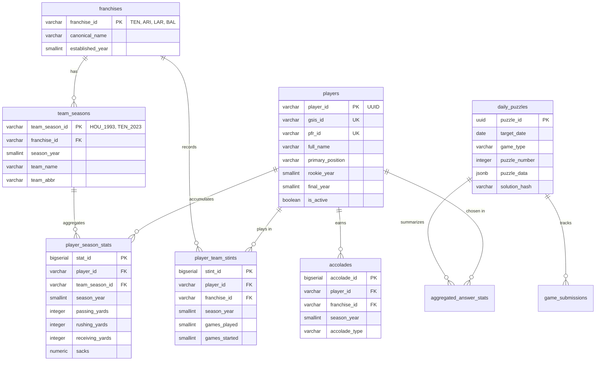

# NFL Daily Mini-Games Platform 🏈

[](https://fastapi.tiangolo.com/)
[](https://nextjs.org/)
[](https://www.postgresql.org/)
[](https://www.python.org/)
[](https://www.typescriptlang.org/)
[](file:///c:/Users/totof/Mis%20proyectos/nfl-games/SPECIFICATION.md)

A production-grade, spec-driven daily trivia and mini-game platform for the NFL. Built with **FastAPI**, **PostgreSQL 16+**, **Next.js 14+ (App Router)**, and powered by historical data extracted from `nflverse` / `nfl_data_py`.

> [!NOTE]
> This platform implements strict domain invariants around franchise lineage, game appearance eligibility, Bayesian rarity scoring, and deterministic puzzle generation as outlined in [SPECIFICATION.md](file:///c:/Users/totof/Mis%20proyectos/nfl-games/SPECIFICATION.md).

---

## 📸 Overview & Mini-Game Modes

The platform hosts four distinct daily mini-game modes designed for NFL statistics, history, and trivia enthusiasts:

| Game Mode | Mechanics Summary | Budget / Constraints | Key Invariant |
| :--- | :--- | :--- | :--- |
| **3x3 Grid** | Immaculate Grid style. Match 3 row criteria against 3 column criteria. | 9 guess budget | Player uniqueness invariant: Each player entity can only be used once per puzzle session. |
| **Reverse Grid** | Pre-populated 9-player matrix; deduce the row/column criteria that satisfy all 9 cells. | 3 incorrect assignment attempts | Criteria validation must satisfy all 9 static players simultaneously. |
| **Connections 4x4** | 16 NFL entities partitioned into 4 difficulty-graded thematic groups of 4. | 4 strike budget | Unique exact partition verified via Knuth's Algorithm X. Advisory `is_one_away` signal on 3/4 matches. |
| **Top 10 Trivia** | Identify the top 10 historical leaders for a statistical/accolade prompt. | 3 incorrect strikes | Reveals rank, player name, and metric value upon correct guess. |

---

## 🏛 Domain Invariants & Franchise Lineage

Handling 100+ years of NFL history requires strict domain invariants to eliminate ambiguities:

### 1. Franchise Continuum Rule
Puzzles querying franchise affiliation evaluate against the **Franchise Continuum ID**, not historic city names or transient acronyms.
* **Titans / Oilers:** Houston Oilers (1960–1996), Tennessee Oilers (1997–1998), and Tennessee Titans (1999–present) share `TEN`.
* **Rams Lineage:** Cleveland Rams (1937–1945), LA Rams (1946–1994, 2016–pres.), and St. Louis Rams (1995–2015) share `LAR`.
* **Commanders Lineage:** Boston Braves/Redskins (1932–1936), Washington Redskins (1937–2019), WFT (2020–2021), and Washington Commanders (2022–pres.) share `WAS`.

> [!IMPORTANT]
> **The Cleveland Browns / Baltimore Ravens Exception (1996 Legal Settlement):**  
> Per official NFL legal settlement, the Baltimore Ravens (`BAL`) are categorized as a 1996 expansion franchise. Pre-1996 Cleveland Browns history remains with `CLE` (suspended 1996–1998, reactivated 1999). A 1994 Browns player does **NOT** satisfy a "Played for Ravens" criterion.

### 2. Official Game Appearance Rule
A player is credited with playing for team $T$ in season $S$ if and only if:
$$\text{regular\_season\_games\_played}(P, T, S) \ge 1$$
* **Excluded:** Preseason-only roster spots, cut in training camp, Practice Squad, or Inactive Reserve (IR) without an active regular season game appearance.
* **Mid-Season Trades:** If a player appeared in $\ge 1$ regular season game for multiple teams in a single year, they satisfy the "Played for" criteria for both franchises.

### 3. Accolades & Statistical Criteria
* **Pro Bowl:** Official roster selection (original ballot or official accepted alternates).
* **All-Pro:** AP (Associated Press) First-Team All-Pro strictly.
* **Super Bowl Champion:** Must be on the official 53-man active roster or injured reserve of the winning team on the Super Bowl game date.
* **Career Sacks:** Official sacks recorded from 1982 onward.

---

## 📐 Math & Algorithmic Engine

### Bayesian Rarity Scoring
To prevent cold-start anomalies early in the day, cell rarity uses a Bayesian smoothed rarity formula:

$$R^*(p, c) = \frac{n(p, c) + M \cdot \pi(p, c)}{N(c) + M} \times 100$$

Where:
* $M = 25$ (prior weight)
* $\pi(p, c) = \frac{1}{|S_c|}$ (uniform prior over historically valid answers)
* $n(p, c)$ is the count of user picks for player $p$ in cell $c$
* $N(c)$ is total picks for cell $c$

### $k$-Guaranteed Grid Solvability
Every generated cell $(r, c)$ in a 3x3 Grid must satisfy a minimum candidate intersection cardinality bound:
$$|S_{r, c}| = |\{P \mid \text{Satisfies}(P, R_r) \land \text{Satisfies}(P, C_c)\}| \ge k \quad (k = 3)$$

Puzzles with bottleneck cells ($|S_{r, c}| < 3$) or overall log-density $\sum \log_{10}(|S_{r, c}|) \notin [12.0, 22.0]$ are automatically rejected.

### Connections Uniqueness (Knuth's Algorithm X)
Connections 4x4 boards undergo Exact Cover validation via Algorithm X to ensure there is **strictly one unique 4-way disjoint partition** into valid quadruplets across the entire domain.

---

## 🗄 Relational Data Model



---

## 📂 Monorepo Architecture

```
nfl-games/
├── apps/
│   ├── api/                      # FastAPI (Python 3.11+) Backend Service
│   │   ├── app/
│   │   │   ├── api/v1/          # Endpoints (Grid, Connections, Top10, Players)
│   │   │   ├── core/            # Config, Redis, DB session management
│   │   │   ├── crud/            # DB access layers
│   │   │   ├── models/          # SQLAlchemy 2.0 ORM Models
│   │   │   └── services/        # Scoring, Validation & Solvability Algorithms
│   │   └── tests/
│   └── web/                      # Next.js 14+ (App Router) Frontend Client
│       ├── src/
│       │   ├── app/             # App Router pages (/grid, /connections, /top10)
│       │   ├── components/      # UI components & client autocomplete Trie
│       │   ├── lib/             # API client, state synchronization, HMAC
│       │   └── hooks/           # Custom React state hooks
│       └── public/              # Static assets & gzipped search catalog
├── packages/
│   ├── contracts/                # Shared TypeScript types auto-generated from OpenAPI
│   └── etl/                      # nfl_data_py ingestion pipeline & puzzle generator
│       ├── pipeline/            # Raw data extraction & entity reconciliation
│       └── generator/           # Seeded deterministic puzzle generation engine
├── docs/                         # Additional documentation
├── README.md                     # Project Overview
└── SPECIFICATION.md              # Technical Specification Document (SDD-001)
```

---

## ⚡ Performance Budgets & SLA Requirements

| Metric | Target / Ceiling | Implementation Strategy |
| :--- | :--- | :--- |
| **Client Search Autocomplete P95** | $\le 50\text{ ms}$ | In-memory Trie / Fuse search index running client-side |
| **API Guess Validation P95** | $\le 150\text{ ms}$ | FastAPI async pipeline + PostgreSQL indexed queries + Redis cache |
| **Search Bundle Payload Size** | $\le 400\text{ KB}$ | Gzipped array-of-arrays wire format (`Cache-Control: immutable`) |
| **Search Bundle Heap Footprint** | $\le 4.5\text{ MB}$ | Parsed browser heap footprint |
| **Daily Puzzle Generation SLA** | $\le 120\text{ sec}$ | Batch compute executed at 00:00:00 UTC for Day $D+7$ |
| **API Availability SLA** | $99.9\%$ | Redundant serverless/container deployment |

---

## 🔌 API Endpoints & Error Protocols

All error responses strictly adhere to **RFC 7807 (Problem Details for HTTP APIs)**:

```json
{
  "type": "https://api.nflminigames.com/v1/errors/INVALID_SUBMISSION",
  "title": "Invalid Guess Submission",
  "status": 422,
  "detail": "Player '00-0033873' has already been used in cell (0, 1) for this puzzle session.",
  "instance": "/api/v1/grid/validate",
  "error_code": "PLAYER_ALREADY_USED",
  "timestamp": "2026-09-04T20:00:45Z"
}
```

### Core API Endpoints Reference

* `GET /api/v1/puzzles/{game_type}/daily` — Fetch daily puzzle (sanitized, answers excluded).
* `POST /api/v1/grid/validate` — Validate a 3x3 grid guess submission & compute Bayesian rarity.
* `GET /api/v1/players/search-index` — Fetch compact compressed search index.
* `POST /api/v1/connections/validate-group` — Validate 4-element group & return `is_one_away` status.
* `POST /api/v1/top10/guess` — Evaluate player guess against Top 10 leaderboard ranks.

---

## 🔒 Client State Management & Anti-Tamper Security

Client game state is managed in local storage under `nfl_games_state_v1`:

* Tracks active puzzle date, remaining guesses/strikes, and revealed cells.
* Includes an **HMAC-SHA256** checksum calculated over the state payload to prevent client-side inspection manipulation.
* Automatically archives and resets upon UTC date transition.

---

## 🛠 Local Development Setup

### Prerequisites
* **Python**: 3.11+
* **Node.js**: 18.x / 20.x+
* **pnpm**: 8.x+
* **PostgreSQL**: 16+
* **Redis**: 7+

### 1. Repository Setup & Dependencies
```bash
# Clone the repository
git clone https://github.com/TomasIFerreyra/nfl-games.git
cd nfl-games

# Install Node monorepo dependencies
pnpm install

# Setup Python virtual environment for backend & ETL
cd apps/api
python -m venv .venv
source .venv/bin/activate  # On Windows: .venv\Scripts\activate
pip install -r requirements.txt
cd ../..
```

### 2. Environment Configuration
Create a `.env` file in the root directory:
```env
POSTGRES_USER=postgres
POSTGRES_PASSWORD=postgres
POSTGRES_DB=nfl_games
POSTGRES_HOST=localhost
POSTGRES_PORT=5432
REDIS_URL=redis://localhost:6379/0
SECRET_KEY=your_development_hmac_secret_key
```

### 3. Database Migration & Data Ingestion
```bash
# Run database migrations
cd apps/api
alembic upgrade head

# Execute ETL ingestion pipeline (fetches nflverse data & populates DB)
cd ../../packages/etl
python -m pipeline.ingest
```

### 4. Running the Development Servers
```bash
# From root directory: run Next.js web client and FastAPI backend in parallel
pnpm dev
```
* **Web Client:** `http://localhost:3000`
* **FastAPI Backend:** `http://localhost:8000`
* **Swagger API Docs:** `http://localhost:8000/docs`

---

## 📄 License & Acknowledgments

This project is licensed under the MIT License.  
Data provided by the [`nflverse`](https://github.com/nflverse) project (`nfl_data_py`). All NFL team logos, names, and trademarks are property of the National Football League.

For complete architectural details, read the full [Software Architecture Specification (SDD-001)](file:///c:/Users/totof/Mis%20proyectos/nfl-games/SPECIFICATION.md).
